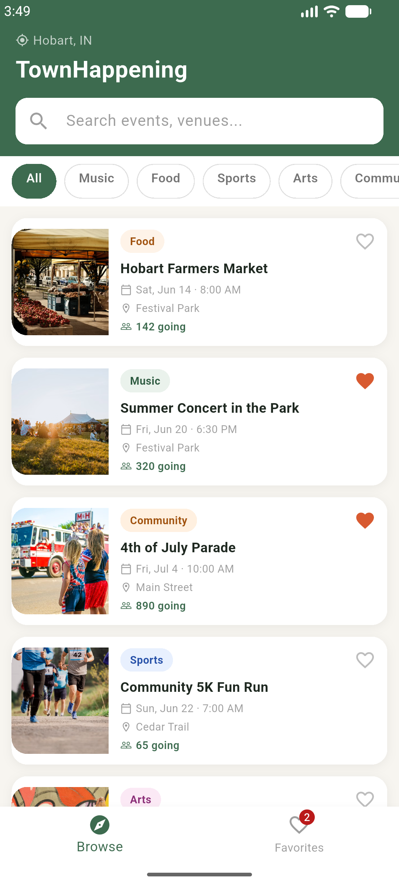
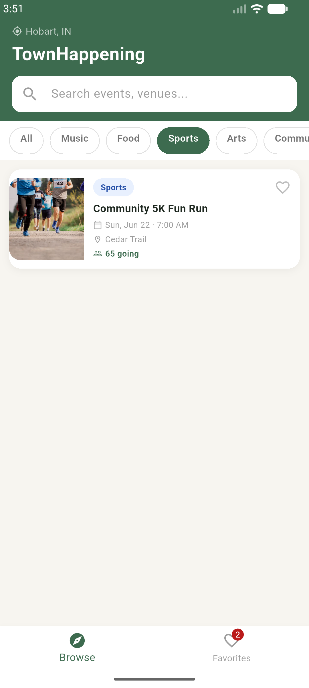
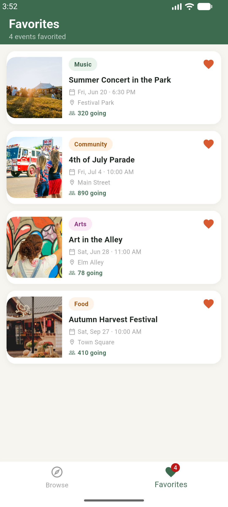
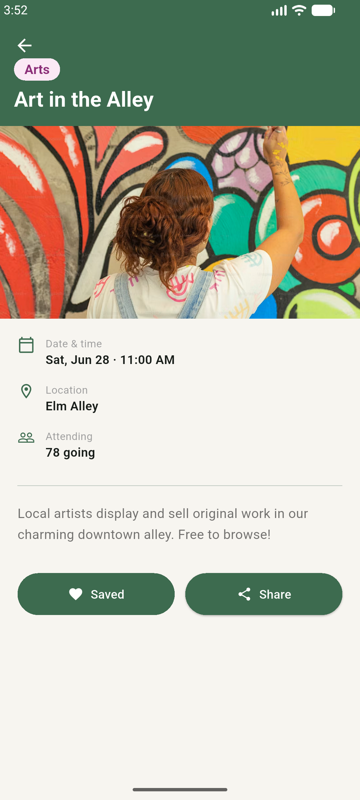
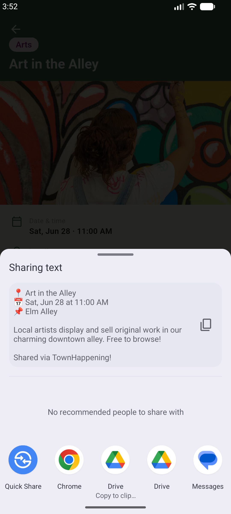
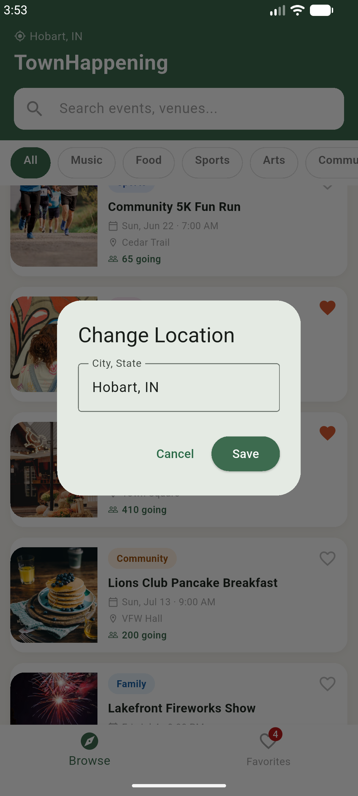
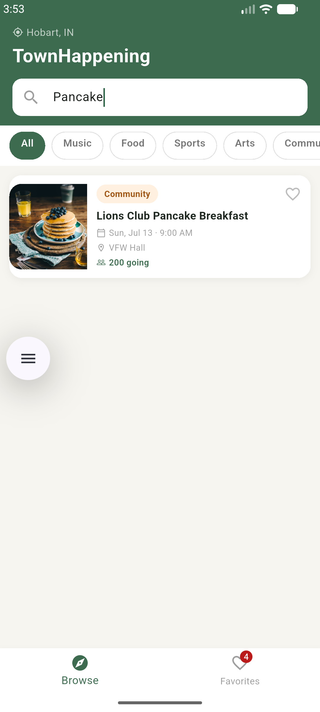
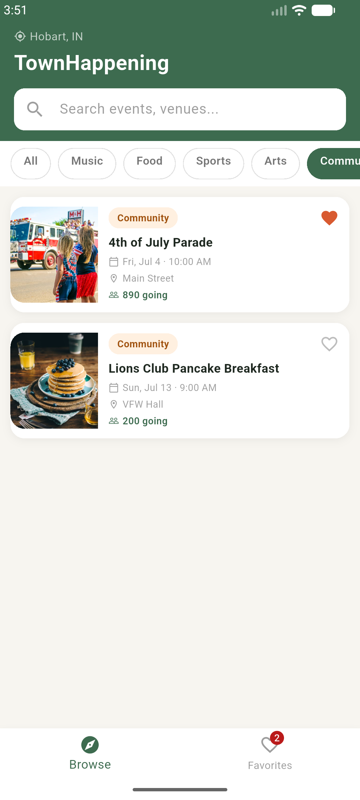

# 📸 4_screenshots: Application UI & User Flows

This directory contains high-resolution mobile application screenshots capturing key screens, modal states, interaction flows, and UI components in **TownHappening**.

---

## 📱 Application Flow Highlights

| Main Discovery Feed | Category Filtering | Saved Favorites | Event Details |
| :---: | :---: | :---: | :---: |
|  |  |  |  |

---

## 🛠️ Interactive Features & Native Integrations

| Native Share Sheet | Location Switcher | Chip Selection | Live Keyword Search |
| :---: | :---: | :---: | :---: |
|  |  |  |  |

---

## 📁 Screenshot Index

* **`1_home_feed.png`:** Main discovery feed showing event listings, search bar, and bottom navigation.
* **`2_category_screen.png`:** Category filtering view displaying organized event categories.
* **`3_favorites_screen.png`:** Favorites screen with saved items, local storage sync, and dynamic badge count.
* **`4_event_screen.png`:** Event Detail screen with collapsing app bar, venue info, and host badge.
* **`5_sharing_screen.png`:** Android native share sheet triggered via `share_plus`.
* **`6_change_location.png`:** Custom dialog modal for switching active town/city filters.
* **`7_chip_selection.png`:** Interactive category chip selection for refining feed results.
* **`8_event_search.png`:** Dynamic search filtering event cards in real time.